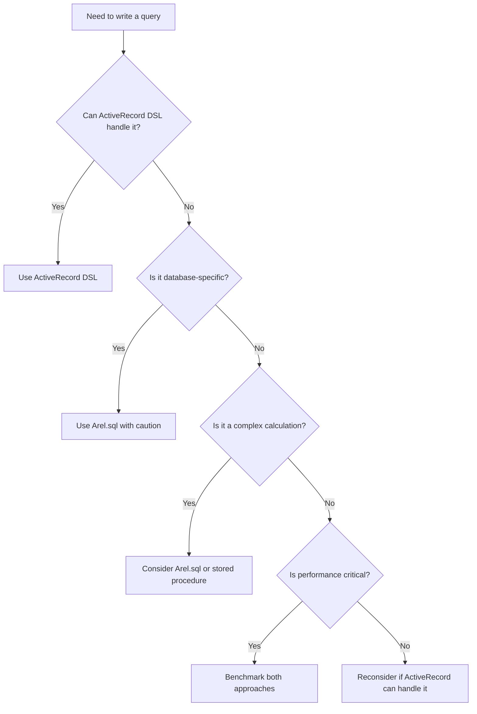

## Introduction

Ruby on Rails' ActiveRecord is renowned for its elegant DSL that shields developers from writing raw SQL. However, there are times when you need to break through this abstraction layer and write custom SQL. That's where `Arel.sql`comes in – your gateway to raw SQL power while maintaining Rails' safety features.

In this comprehensive guide, we'll explore when and how to use `Arel.sql`, complete with real-world examples and best practices that will level up your Rails SQL game.

## What is Arel?

**Arel** (A Relational Algebra) is the SQL Abstract Syntax Tree (AST) manager that powers ActiveRecord. While you typically don't interact with Arel directly, it's the engine behind every ActiveRecord query you write.

```ruby
# When you write this:
User.where(active: true).order(created_at: :desc)

# ActiveRecord uses Arel to build the SQL:
# SELECT "users".* FROM "users" WHERE "users"."active" = TRUE ORDER BY "users"."created_at" DESC
```

### The Arel Module in Rails 8.0.2

```ruby
module Arel
  VERSION = "10.0.0"
  
  def self.sql(sql_string, *positional_binds, retryable: false, **named_binds)
    # Wraps raw SQL for safe execution
  end
end
```

## Understanding Arel.sql

The `Arel.sql` method is your bridge between ActiveRecord's safety and SQL's power. It tells Rails: "Trust me, this SQL is safe, execute it as-is."

### Method Signature

```ruby
Arel.sql(sql_string, *positional_binds, retryable: false, **named_binds)
```

**Parameters:**

* `sql_string` - The raw SQL to execute
    
* `*positional_binds` - Values for `?` placeholders
    
* `retryable` - Marks SQL as safe to retry (for idempotent operations)
    
* `**named_binds` - Values for `:name` placeholders
    

### Basic Usage Examples

```ruby
# Simple raw SQL
Post.order(Arel.sql("LOWER(title) ASC"))

# With positional parameters
User.where(Arel.sql("created_at > ?", 30.days.ago))

# With named parameters
Product.where(Arel.sql("price BETWEEN :min AND :max", min: 10, max: 100))

# Marking as retryable
User.select(Arel.sql("COUNT(*) as total", retryable: true))
```

## When ActiveRecord's DSL Falls Short

Let's explore the specific scenarios where raw SQL becomes necessary:

### 1\. Database-Specific Functions

ActiveRecord can't abstract every database's unique features.

**PostgreSQL Full-Text Search:**

```ruby
# ❌ Can't express with ActiveRecord DSL
Article.where("to_tsvector('english', content) @@ plainto_tsquery('english', 'ruby')")

# ✅ Proper implementation with Arel.sql
class Article < ApplicationRecord
  scope :search, ->(query) {
    where(
      Arel.sql(
        "to_tsvector('english', title || ' ' || content) @@ plainto_tsquery('english', ?)",
        query
      )
    )
  }
end
```

**MySQL-Specific Functions:**

```ruby
# GROUP_CONCAT in MySQL
Product.select(
  "products.*",
  Arel.sql("GROUP_CONCAT(tags.name SEPARATOR ', ') as tag_list")
).joins(:tags).group("products.id")
```

### 2\. Window Functions

ActiveRecord has no built-in support for analytical functions like `ROW_NUMBER()`, `RANK()`, `LAG()`, or `LEAD()`.

```ruby
class Employee < ApplicationRecord
  scope :with_salary_rank, -> {
    select(
      "employees.*",
      Arel.sql("
        RANK() OVER (PARTITION BY department_id ORDER BY salary DESC) as dept_rank,
        LAG(salary) OVER (ORDER BY hire_date) as previous_salary,
        PERCENT_RANK() OVER (ORDER BY salary) * 100 as salary_percentile
      ")
    )
  }
end

# Usage
Employee.with_salary_rank.where(department: 'Engineering')
```

### 3\. Complex Mathematical Operations

Statistical functions and complex calculations require raw SQL.

```ruby
class Sale < ApplicationRecord
  def self.statistics_by_month
    select(
      Arel.sql("
        DATE_TRUNC('month', created_at) as month,
        AVG(amount) as avg_sale,
        STDDEV(amount) as std_deviation,
        PERCENTILE_CONT(0.5) WITHIN GROUP (ORDER BY amount) as median,
        PERCENTILE_CONT(0.95) WITHIN GROUP (ORDER BY amount) as p95
      ")
    ).group(Arel.sql("DATE_TRUNC('month', created_at)"))
  end
end
```

### 4\. Conditional Aggregations

```ruby
class Order < ApplicationRecord
  scope :summary_report, -> {
    select(
      Arel.sql("
        DATE(created_at) as order_date,
        COUNT(*) as total_orders,
        COUNT(*) FILTER (WHERE status = 'completed') as completed_orders,
        SUM(CASE WHEN priority = 'high' THEN 1 ELSE 0 END) as high_priority,
        SUM(total) FILTER (WHERE status = 'completed') as revenue
      ")
    ).group(Arel.sql("DATE(created_at)"))
  }
end
```

### 5\. JSON/JSONB Operations

```ruby
class User < ApplicationRecord
  # PostgreSQL JSONB queries
  scope :with_nested_preference, ->(path, value) {
    where(
      Arel.sql(
        "jsonb_extract_path_text(preferences, VARIADIC ?) = ?",
        path.split('.'),
        value
      )
    )
  }
  
  # Check if JSON array contains value
  scope :has_role, ->(role) {
    where(Arel.sql("? = ANY(SELECT jsonb_array_elements_text(roles))", role))
  }
end

# Usage
User.with_nested_preference('notifications.email', 'true')
User.has_role('admin')
```

## Practical Examples

### Example 1: Geospatial Queries with Haversine Formula

```ruby
class Store < ApplicationRecord
  # Find stores within a certain radius using the Haversine formula
  scope :within_radius, ->(lat, lng, radius_km) {
    earth_radius = 6371 # Earth's radius in kilometers
    
    select("stores.*")
      .select(
        Arel.sql(
          "(? * acos(
            cos(radians(?)) * cos(radians(latitude)) * 
            cos(radians(longitude) - radians(?)) + 
            sin(radians(?)) * sin(radians(latitude))
          )) AS distance",
          earth_radius, lat, lng, lat
        )
      )
      .where(
        Arel.sql(
          "(? * acos(
            cos(radians(?)) * cos(radians(latitude)) * 
            cos(radians(longitude) - radians(?)) + 
            sin(radians(?)) * sin(radians(latitude))
          )) < ?",
          earth_radius, lat, lng, lat, radius_km
        )
      )
      .order(Arel.sql("distance ASC"))
  }
end

# Find all stores within 10km of a location
Store.within_radius(40.7128, -74.0060, 10)
```

### Example 2: Recursive CTE for Hierarchical Data

```ruby
class Category < ApplicationRecord
  def self.full_tree(root_id = nil)
    sql = <<-SQL
      WITH RECURSIVE category_tree AS (
        SELECT *, 0 as depth, ARRAY[id] as path
        FROM categories 
        WHERE #{root_id ? 'id = ?' : 'parent_id IS NULL'}
        
        UNION ALL
        
        SELECT c.*, ct.depth + 1, ct.path || c.id
        FROM categories c
        INNER JOIN category_tree ct ON c.parent_id = ct.id
        WHERE NOT (c.id = ANY(ct.path))
      )
      SELECT * FROM category_tree ORDER BY path
    SQL
    
    root_id ? find_by_sql([sql, root_id]) : find_by_sql(sql)
  end
end
```

### Example 3: Advanced Full-Text Search with Ranking

```ruby
class Article < ApplicationRecord
  scope :advanced_search, ->(query, options = {}) {
    language = options[:language] || 'english'
    weight_title = options[:weight_title] || 2.0
    weight_content = options[:weight_content] || 1.0
    
    select("articles.*")
      .select(
        Arel.sql(
          "ts_rank(
            setweight(to_tsvector(?, title), 'A') || 
            setweight(to_tsvector(?, content), 'B'),
            plainto_tsquery(?, ?),
            32
          ) * ? + 
          ts_rank(
            to_tsvector(?, content),
            plainto_tsquery(?, ?),
            32
          ) * ? AS relevance",
          language, language, language, query, weight_title,
          language, language, query, weight_content
        )
      )
      .where(
        Arel.sql(
          "to_tsvector(?, title || ' ' || content) @@ plainto_tsquery(?, ?)",
          language, language, query
        )
      )
      .order(Arel.sql("relevance DESC"))
  }
  
  # Highlight search results
  scope :with_highlights, ->(query) {
    select(
      Arel.sql(
        "ts_headline('english', content, plainto_tsquery('english', ?), 
         'MaxWords=50, MinWords=25, ShortWord=3, 
          HighlightAll=FALSE, MaxFragments=3,
          FragmentDelimiter=\"...\"') as excerpt",
        query
      )
    )
  }
end
```

### Example 4: Time-Series Data with Gap Filling

```ruby
class Metric < ApplicationRecord
  def self.hourly_with_gaps_filled(start_time, end_time)
    sql = <<-SQL
      WITH time_series AS (
        SELECT generate_series(
          DATE_TRUNC('hour', ?::timestamp),
          DATE_TRUNC('hour', ?::timestamp),
          '1 hour'::interval
        ) AS hour
      )
      SELECT 
        ts.hour,
        COALESCE(m.value, 0) as value,
        COALESCE(m.count, 0) as count,
        CASE WHEN m.value IS NULL THEN true ELSE false END as is_interpolated
      FROM time_series ts
      LEFT JOIN (
        SELECT 
          DATE_TRUNC('hour', created_at) as hour,
          AVG(value) as value,
          COUNT(*) as count
        FROM metrics
        WHERE created_at BETWEEN ? AND ?
        GROUP BY DATE_TRUNC('hour', created_at)
      ) m ON ts.hour = m.hour
      ORDER BY ts.hour
    SQL
    
    find_by_sql([sql, start_time, end_time, start_time, end_time])
  end
end
```

## Security Considerations

### ⚠️ The Golden Rule

**NEVER interpolate user input directly into SQL strings!**

```ruby
# ❌ NEVER DO THIS - SQL Injection vulnerability!
search = params[:search]
User.where(Arel.sql("name LIKE '%#{search}%'"))

# ❌ ALSO WRONG
User.where(Arel.sql("status = '#{params[:status]}'"))

# ✅ CORRECT - Using placeholders
User.where(Arel.sql("name LIKE ?", "%#{params[:search]}%"))
User.where(Arel.sql("status = ?", params[:status]))
```

### Safe Patterns

```ruby
class SafeQueryBuilder
  # Pattern 1: Whitelist allowed values
  ALLOWED_SORT_COLUMNS = %w[name created_at price].freeze
  
  def self.sorted(column, direction = 'ASC')
    unless ALLOWED_SORT_COLUMNS.include?(column)
      raise ArgumentError, "Invalid sort column"
    end
    
    direction = direction.upcase == 'DESC' ? 'DESC' : 'ASC'
    
    Product.order(Arel.sql("#{column} #{direction}"))
  end
  
  # Pattern 2: Use prepared statements
  def self.complex_search(criteria)
    sql = "SELECT * FROM products WHERE "
    conditions = []
    values = []
    
    if criteria[:name]
      conditions << "name ILIKE ?"
      values << "%#{criteria[:name]}%"
    end
    
    if criteria[:min_price]
      conditions << "price >= ?"
      values << criteria[:min_price]
    end
    
    Product.find_by_sql([sql + conditions.join(' AND '), *values])
  end
end
```

## Best Practices

### 1\. Start with ActiveRecord DSL

Always try ActiveRecord's built-in methods first:

```ruby
# ✅ Prefer ActiveRecord when possible
User.where(active: true)
     .joins(:posts)
     .group(:id)
     .having('COUNT(posts.id) > ?', 5)

# Only use Arel.sql when truly necessary
```

### 2\. Extract Complex Queries to Scopes

```ruby
class Product < ApplicationRecord
  # Good: Encapsulated, reusable, testable
  scope :search_by_similarity, ->(term, threshold = 0.3) {
    return none if term.blank?
    
    select("*, similarity(name, ?) AS sim", term)
      .where(Arel.sql("similarity(name, ?) > ?", term, threshold))
      .order(Arel.sql("sim DESC"))
  }
end
```

### 3\. Document Why Raw SQL is Needed

```ruby
class Report < ApplicationRecord
  # Uses raw SQL for PostgreSQL-specific window functions
  # that aren't supported by ActiveRecord's DSL.
  # This allows us to calculate running totals efficiently
  # in a single query instead of N+1 queries.
  scope :with_running_total, -> {
    select(
      "reports.*",
      Arel.sql("SUM(amount) OVER (ORDER BY created_at) AS running_total")
    )
  }
end
```

### 4\. Consider Database Views

For very complex queries, consider creating a database view:

```ruby
# db/migrate/xxx_create_sales_summary_view.rb
class CreateSalesSummaryView < ActiveRecord::Migration[7.0]
  def up
    execute <<-SQL
      CREATE VIEW sales_summaries AS
      SELECT 
        DATE(created_at) as date,
        store_id,
        COUNT(*) as transaction_count,
        SUM(amount) as total_revenue,
        AVG(amount) as average_sale
      FROM sales
      GROUP BY DATE(created_at), store_id
    SQL
  end
  
  def down
    execute "DROP VIEW sales_summaries"
  end
end

# app/models/sales_summary.rb
class SalesSummary < ApplicationRecord
  self.table_name = 'sales_summaries'
  self.primary_key = nil
  
  # Now you can use regular ActiveRecord methods
  scope :for_store, ->(store_id) { where(store_id: store_id) }
  scope :recent, -> { where('date > ?', 30.days.ago) }
end
```

### 5\. Test Database-Specific Code

```ruby
# spec/models/product_spec.rb
RSpec.describe Product, type: :model do
  describe '.search' do
    it 'finds products using full-text search' do
      # Skip if not PostgreSQL
      skip "PostgreSQL specific feature" unless 
        ActiveRecord::Base.connection.adapter_name == 'PostgreSQL'
      
      product = create(:product, name: 'Ruby Programming', 
                                 content: 'Learn Ruby and Rails')
      
      results = Product.search('ruby rails')
      
      expect(results).to include(product)
      expect(results.first.relevance).to be > 0
    end
  end
end
```

## Decision Framework

### When to Use Arel.sql

Use this decision tree to determine if you need raw SQL:



### Quick Reference: When to Use What

| Scenario | ActiveRecord DSL | Arel.sql |
| --- | --- | --- |
| Simple WHERE conditions | ✅ `where(name: 'John')` | ❌ Unnecessary |
| Basic JOINs | ✅ `joins(:user)` | ❌ Unnecessary |
| Simple ordering | ✅ `order(created_at: :desc)` | ❌ Unnecessary |
| Window functions | ❌ Not supported | ✅ Required |
| Database-specific functions | ❌ Not supported | ✅ Required |
| Complex CASE in ORDER | ❌ Limited support | ✅ Better control |
| CTEs (WITH clauses) | ❌ Not supported | ✅ Required |
| Full-text search | ❌ Not supported | ✅ Required |
| Complex JSON operations | ⚠️ Basic support | ✅ Full control |
| Statistical functions | ❌ Very limited | ✅ Required |

## Performance Considerations

### Benchmarking Your Queries

Always benchmark when using raw SQL for performance:

```ruby
require 'benchmark'

Benchmark.bm do |x|
  x.report("ActiveRecord:") do
    1000.times do
      User.joins(:posts)
          .where(posts: { published: true })
          .distinct
    end
  end
  
  x.report("Raw SQL:") do
    1000.times do
      User.find_by_sql([
        "SELECT DISTINCT users.* FROM users 
         WHERE EXISTS (
           SELECT 1 FROM posts 
           WHERE posts.user_id = users.id 
           AND posts.published = ? 
           LIMIT 1
         )", true
      ])
    end
  end
end
```

### Query Plan Analysis

```ruby
# Analyze query performance
def analyze_query(scope)
  sql = scope.to_sql
  explanation = ActiveRecord::Base.connection.execute("EXPLAIN ANALYZE #{sql}")
  puts explanation.values
end

analyze_query(Product.search("ruby"))
```

## Conclusion

`Arel.sql` is a powerful tool in your Rails arsenal, but it should be used judiciously. It bridges the gap between ActiveRecord's safety and SQL's flexibility, allowing you to leverage database-specific features and optimizations when needed.

### Key Takeaways

1. **Start with ActiveRecord's DSL** - It's safer and more maintainable
    
2. **Use Arel.sql when necessary** - For database-specific features, window functions, and complex operations
    
3. **Always use placeholders** - Never interpolate user input directly
    
4. **Document your reasoning** - Explain why raw SQL was necessary
    
5. **Test thoroughly** - Especially across different database adapters
    
6. **Consider alternatives** - Database views, stored procedures, or data restructuring
    

Remember: With great power comes great responsibility. Use `Arel.sql` wisely, and your Rails applications will benefit from both the safety of ActiveRecord and the power of raw SQL when you truly need it.